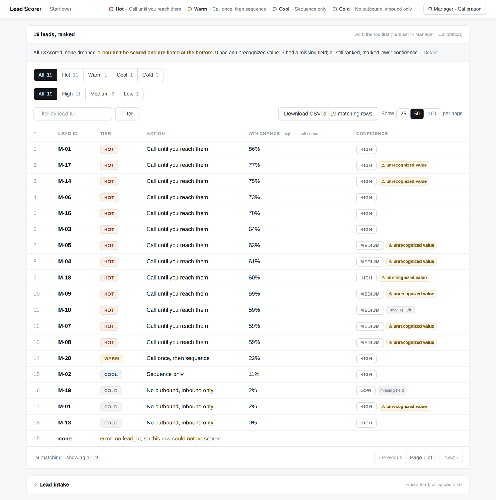
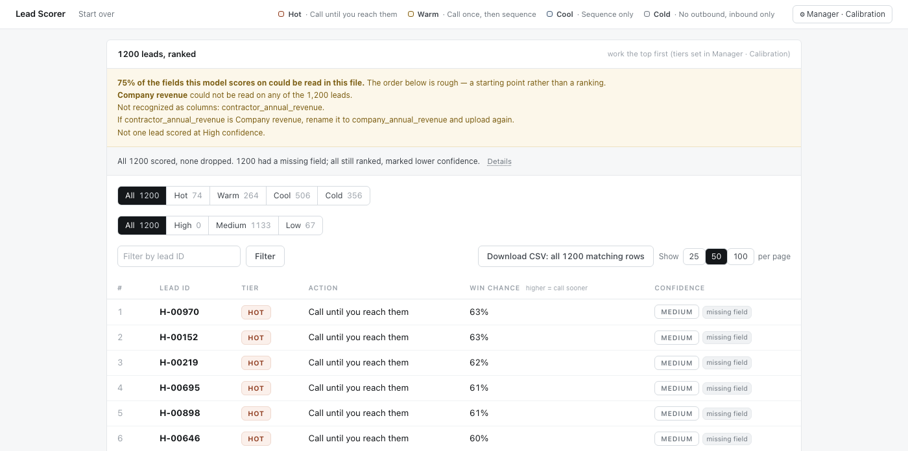
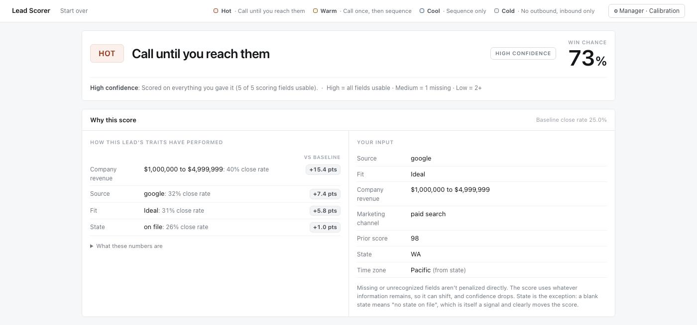

# GTM Lead Scorer

A lead-scoring and routing system that turns raw inbound-lead data into a ranked, explainable
action queue for sales reps: **who to work, how hard, and why**. Score one lead, or upload a
CSV to prioritize a whole list.



*Upload a list and every lead is scored, tiered, and ordered by win-propensity, each with a
specific next action. Messy rows are flagged and still ranked, never dropped.*

## Background

Built to solve a real go-to-market problem: scoring and triaging inbound leads for a B2B
sales team so reps know who to work first. The original dataset is confidential, so this
public version runs entirely on synthetic data generated to match its exact format — see
[How the data was made](#how-the-data-was-made) for the generator and the numbers behind it.
The model, the tool, and the approach are the real ones; only the underlying data is a
stand-in.

## Impact

The system is built to move revenue by fixing how rep time gets allocated. Instead of leads
getting attention in roughly the order they arrive, reps work a queue ordered by
win-propensity, so the highest-probability leads are called first and the lowest get a lighter
touch or inbound-only. Concretely, it:

- ranks every inbound lead and assigns a tier and a specific next action, so a rep opens the
  list and knows exactly who to call, how hard, and why;
- lets a manager set the tier cutoffs to match team capacity, turning "who do we have time
  for" into a deliberate, adjustable decision rather than an accident of volume;
- stays reliable on the messy CRM exports reps actually paste in — bad rows are flagged and
  still ranked, never dropped or silently mis-scored — so the queue stays trustworthy.

This was built as a case study on a real GTM problem and validated on synthetic data (see
Background), so it is not a production deployment with live usage or revenue figures. The
contribution is the working system and the decisions behind it: what to predict, how to make
the score explainable enough that a rep will actually act on it, and how to keep it robust on
real-world input.

## Run it

**Live demo:** _(add the URL here after deploying)_

```
pip install -r requirements.txt
python3 app.py
# open http://localhost:5000
```

The fitted model ships in the repo (`model.joblib`), so it runs offline on a fresh clone.
If port 5000 is taken (macOS AirPlay uses it), run `PORT=8000 python3 app.py`. The form loads
pre-filled with an example lead, so you can click **Score** immediately or edit it first.

Then click **Score the sample file** under **List** to see the ranked queue — that runs
`demo_leads.csv`, so there is nothing to find first. `leads_messy_fixture.csv` is the other
one worth uploading — see [What it does](#what-it-does).

### Deploy it

The app serves under gunicorn, which is what every host below actually runs:

```
gunicorn app:app --bind 0.0.0.0:$PORT --workers 1 --threads 8 --timeout 120
```

- **Render** — New → Blueprint → point it at this repo. `render.yaml` sets the build and
  start commands, pins the Python version, and points the health check at `/healthz`.
- **Any Procfile host** (Heroku, Railway, Fly) — the `Procfile` carries the same command.
- **Docker** — `docker build -t lead-scorer . && docker run -p 8000:8000 lead-scorer`.

`python3 app.py` stays bound to `127.0.0.1`, because that path is the Flask development
server and should not be listening to a network. Set `HOST=0.0.0.0` to override it inside a
container. Uploads are capped at 10MB.

## Tests

```
pip install -r requirements-dev.txt
pytest
```

Covers the parity between the typed and uploaded paths (the same lead has to score the same
either way — it did not, once), ingestion of the messy fixture, what an unrecognized value is
allowed to change, that junk sinks instead of ranking, and that a file the model cannot read
is refused rather than ranked. `test_export_golden.py` holds the exported bytes for
`demo_leads.csv` fixed, so a change to anything else cannot quietly move a score.

## What it does

- **Score** — probability of winning, from an intake-only model (nothing that happens after
  a lead arrives is used, so it is a score a rep could actually have at intake time).
- **Tier** — Hot / Warm / Cool / Cold, each with one action (call until reached, call once
  then sequence, sequence only, inbound only). A manager can drag the cutoffs.
- **Why** — the real historical win rate for each of the lead's traits, so a rep trusts it.
- **Confidence** — High / Medium / Low, with a flag for every missing or unrecognized field.
- **Messy input is safe** — bad rows are flagged and ranked low, never crash the tool or sneak
  to the top.
- **It says when it can't** — the model only knows the vocabulary it was fit on. If too few of
  a file's values are ones it has seen, the page says so above the board; if almost none are,
  it declines to rank the file at all and names the columns it read, the ones it ignored, and
  the ones it scores on. A confident-looking queue built out of values the model never saw is
  worse than no queue.



*The failure that prompted this: an export identical to the training schema except that its
revenue column is named `contractor_annual_revenue`. That column is ignored, so every lead is
scored one field short. It still ranks — but the page says how much of the file it could read,
which field it could not, and what to rename.*

Two files ship for trying it under **List → Rank**:

| file | what it is |
| --- | --- |
| `demo_leads.csv` | 250 clean leads. **Start here** — it is what the screenshot above shows. |
| `leads_messy_fixture.csv` | the robustness test: 19 leads, each broken a different way (mis-cased headers, an unclosed quote, a duplicate ID, a missing ID, ragged rows, junk numbers). Every row still comes back, flagged and ranked. |



*Scoring a single lead: the win-propensity, the tier and next action, a confidence level, and a
plain-English "why" built from each trait's historical close rate.*

## How the data was made

The original dataset is confidential, so the public version runs on synthetic data built by
`make_synthetic_data.py`. Everything about that world is an invented parameter table at the
top of that file — level mixes, effect sizes, blank rates — and the generator is seeded, so
the same command reproduces the same rows byte for byte:

```
python3 make_synthetic_data.py   # writes data/leads_train.csv (9,000 rows) and demo_leads.csv
python3 train_and_save.py        # fits model.joblib, writes meta.json, prints the tier split
```

Two things it does deliberately, because they are the difference between a plausible dataset
and a useless one:

- **The features covary.** Each lead draws a latent quality score, and channel, fit, revenue
  and prior score are drawn from it. Independent draws would let the best possible
  combination stack every bonus and predict a 90% win chance on an inbound lead, which no
  sales team would believe. As built, the model tops out in the low 70s.
- **The relationships overlap.** Paid search beats paid social, revenue is monotone, a
  missing state is genuinely bad — but every one of them is noisy enough that the segments
  interleave, so the model has something real to learn rather than a lookup table.

The training set is committed (`data/leads_train.csv`) so the claim is checkable rather than
asserted. `make_synthetic_data.py` also fails loudly if the regenerated close rates land
within three points of the figures they replaced.

## Files

- `app.py` — the Flask web app
- `scorer.py` — scoring logic (score, tier, why, confidence) and the tier vocabulary
- `csv_io.py` / `flags.py` / `format.py` — CSV ingest, bad-value flagging, formatting
- `templates/` — the UI
- `model.joblib`, `meta.json` — the fitted model and its metadata
- `make_synthetic_data.py` / `train_and_save.py` — the data generator and the training run
- `test_scorer.py` — the test suite
- `test_schema_match.py` / `test_schema_guard.py` — the file-level match check and what it does
- `scripts/shoot_screenshots.py` — regenerates the images above
- `scripts/make_test_fixtures.py` — regenerates the CSV fixtures the tests read
- `Procfile` / `render.yaml` / `Dockerfile` — the three ways to deploy it
